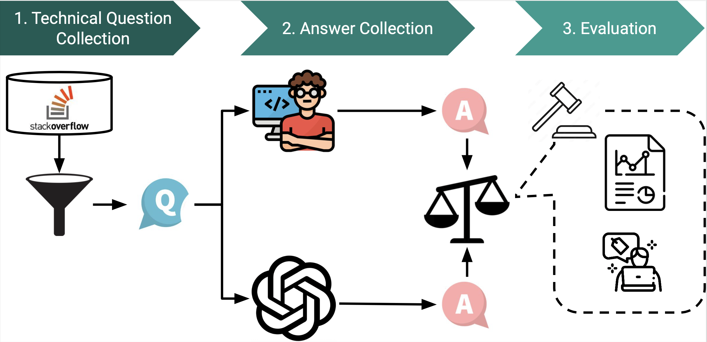

# Are We Ready to Embrace Generative AI for Software Q&A?

## Overview

## Questionnaire Result

- Q1: How satisfied are you with the answer? (Required)

  Result of Q1

- Q2: Please explain your rate on the answer.

- Q3: Do you think the answer correctly understands the question? (Required)

  Result of ChatGPT-generated answers for Q3

  Result of Human-written answers for Q3

- Q4: Do you think the answer fully addresses the question? (Required)

  Result of ChatGPT-generated answers for Q4

  Result of Human-written answers for Q4

- Q5: Is there any factual error in the answer?  (Required)

  Result of ChatGPT-generated answers for Q5

  Result of Human-written answers for Q5

- Q6: If your answer to the previous question is Yes, please explain.

- Q7: Can you guess which one is generated by AI? (Required)

  Result of Q7

